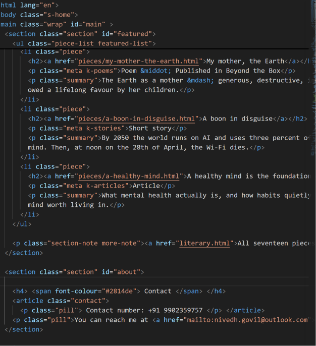
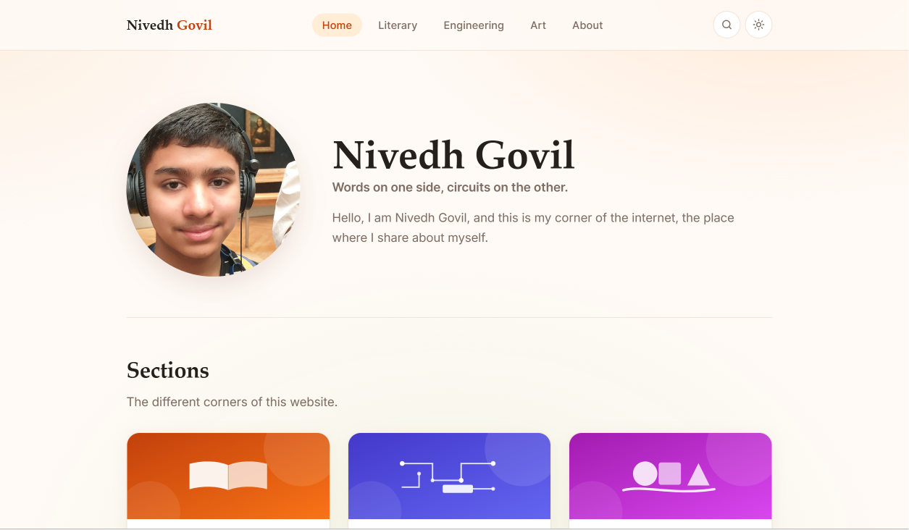
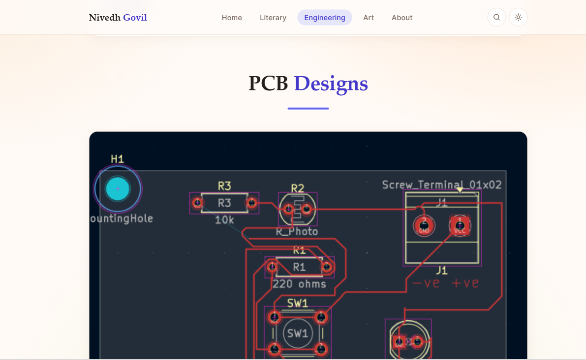

# Nivedh Govil, my own website.

I am Nivedh and this is the README for my own personal website, a project I've been longing for a very long time. This website has some of the skills which I have, for example, engineering, writing, and art.

On opening my website the first page is the home page, which has a brief description of the entire website, some more things, and a Contact Me button. The other pages, for example, the Literary page, have links to my work, for example, the articles, essays, and poems I have written.

I've used HTML, CSS, and a little bit of JavaScript.
## Use of AI
I have used AI, only for help on CSS and Javascript.

## How to run it

1. Clone the repo:

```bash
 git clone https://github.com/NivedhGovil/nivedh-website.git
```
2. Open the repository
```bash
cd nivedh-website
```
3. Click on index.html

## Images of the progress

Here are some screenshots: <br> 
 <br> 
 <br> 

